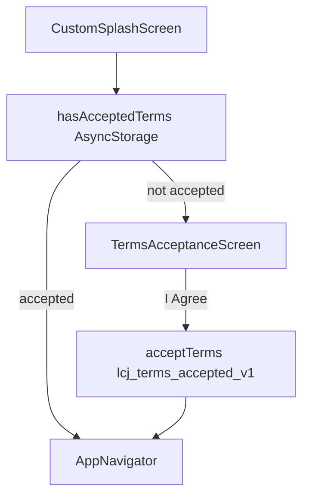
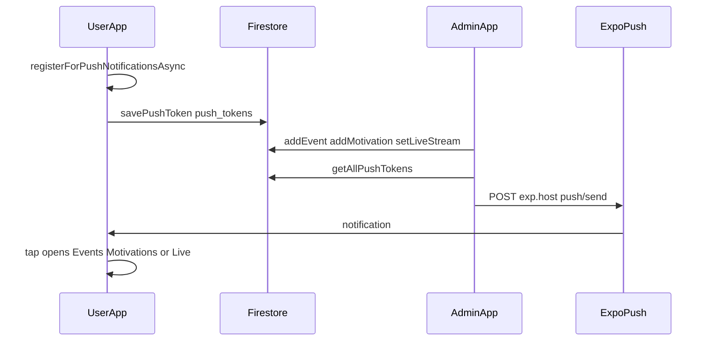

# Life Changing Journey — Implementation Summary

This document is the authoritative reference for production-readiness work, legal/terms gating, URL normalization, store configuration, auth hardening, and push notifications implemented in the Expo mobile app.

**Canonical website:** `https://www.lifechangingjourney.co.za`  
**Legal source:** `LCJ_Terms_and_Policies.docx` (v1.0, last updated 19 May 2026)  
**Platforms:** iOS App Store, Google Play, Huawei App Gallery

Related docs:
- [Membership in the Expo app](MEMBERSHIP_EXPO_APP.md)
- [Firebase setup](../FIREBASE_SETUP.md)
- [iOS release guide](../IOS_RELEASE_GUIDE.md)
- [Admin setup](../ADMIN_SETUP.md)

---

## 1. Overview

| Area | Status |
|------|--------|
| First-install terms acceptance | Implemented |
| URL / branding normalization | Implemented |
| iOS / Android / Huawei store config | Implemented (EAS profiles) |
| Demo admin disabled in production | Implemented |
| Firebase password reset | Implemented |
| Push notifications (Daily Word, Events, Live) | Implemented |
| Membership web integration | Implemented (see MEMBERSHIP_EXPO_APP.md) |

**Stack:** Expo SDK 54, React Native 0.81, React Navigation (`src/navigation/`), Firebase Auth + Firestore, optional Supabase fallback.

**Entry flow:** `index.js` → `App.js` → splash → terms gate → `AppNavigator` → `AuthNavigator` or `MainNavigator`.

---

## 2. First-install terms acceptance

Users must accept Terms of Service, Privacy Policy, and Legal Policies before using the app. Content is derived from `LCJ_Terms_and_Policies.docx`.

### Flow



### Behaviour

- Shown **once per install** (or again if `TERMS_VERSION` changes in code).
- User must scroll content, check the agreement box, and tap **I Agree — Continue**.
- Acceptance stored in AsyncStorage key `lcj_terms_accepted_v1` with version `1.0` and timestamp.
- Register screen also requires an explicit terms checkbox with link to the full legal page.

### Legal URL

`https://www.lifechangingjourney.co.za/legal/terms-and-policies`

### Key files

| File | Role |
|------|------|
| `src/data/termsAndPolicies.js` | Condensed sections, version, legal URL |
| `src/services/termsService.js` | `hasAcceptedTerms()`, `acceptTerms()`, `clearTermsAcceptance()` (dev) |
| `src/screens/legal/TermsAcceptanceScreen.js` | Full-screen gate UI |
| `App.js` | `AppContent` blocks navigator until terms accepted |
| `src/screens/auth/RegisterScreen.js` | Required checkbox + legal link |
| `src/utils/constants.js` | `STORAGE_KEYS.TERMS_ACCEPTED` |

### Reset terms (testing)

Clear app storage or call `clearTermsAcceptance()` from `termsService.js` in dev.

---

## 3. URL and branding normalization

All public-facing links use **`https://www.lifechangingjourney.co.za`** unless overridden.

### Constants (`src/utils/constants.js`)

| Constant | Value |
|----------|-------|
| `SITE_URL` | `https://www.lifechangingjourney.co.za` |
| `PUBLIC_SITE_URL` | Same; override only via `EXPO_PUBLIC_LCJ_WEB_URL` |
| `CONTACT.email` | `info@lifechangingjourney.co.za` |
| `CONTACT.phone` | `+27 31 035 0208` |
| `CONTACT.website` | `https://www.lifechangingjourney.co.za` |

**Membership checkout:** `{PUBLIC_SITE_URL}/plans` — opened from `MembershipPackagesScreen.js`.

### Files updated (non-www / old domain removed)

- `src/utils/staticData.js`
- `src/screens/main/ResourcesScreen.js`
- `src/screens/services/MentalWellnessScreen.js`
- `src/screens/services/SpiritualGrowthScreen.js`
- `src/screens/services/HypnotherapyScreen.js`
- `src/services/geminiService.js`

### Environment variables

| Variable | Purpose |
|----------|---------|
| `EXPO_PUBLIC_LCJ_WEB_URL` | Override site URL (e.g. LAN IP for local `membership-web` testing) |
| `EXPO_PUBLIC_ENV=production` | Set in EAS production profile; disables demo admin |

---

## 4. Production store configuration

### `app.json`

| Platform | Configuration |
|----------|---------------|
| **iOS** | `bundleIdentifier`: `com.lifechangingjourney.app`, `associatedDomains`: `applinks:www.lifechangingjourney.co.za`, `UIBackgroundModes`: `remote-notification` |
| **Android** | `package`: `com.lifechangingjourney.app`, `versionCode`: 1, permissions: `INTERNET`, `ACCESS_NETWORK_STATE`, `POST_NOTIFICATIONS`, `VIBRATE`, deep-link intent filters for `www.lifechangingjourney.co.za` |
| **Extra** | `privacyPolicyUrl`, `termsUrl`, `websiteUrl` pointing to `.co.za` legal and home pages |
| **Plugins** | `expo-splash-screen`, `expo-notifications` (icon, color `#012630`) |

### `eas.json`

| Profile | Purpose |
|---------|---------|
| `production` | `EXPO_PUBLIC_ENV=production`, `EXPO_PUBLIC_LCJ_WEB_URL=https://www.lifechangingjourney.co.za`, Android `app-bundle` (Play Store) |
| `production-huawei` | Extends production, Android `apk` for Huawei App Gallery |
| `submit.production` | iOS (Apple ID / team), Android (requires `google-play-service-account.json`) |

### Build commands

```bash
# iOS App Store
eas build --platform ios --profile production

# Google Play (AAB)
eas build --platform android --profile production

# Huawei App Gallery (APK)
eas build --platform android --profile production-huawei

# Submit (after build)
eas submit --platform ios --latest
eas submit --platform android --latest
```

---

## 5. Auth and security hardening

### Demo admin disabled in production

In `src/context/AuthContext.js`, the hardcoded demo admin (`life.changing@admin.com`) is **disabled** when:

- `EXPO_PUBLIC_ENV === 'production'`, or
- `__DEV__` is false (release builds)

Demo admin restore from AsyncStorage is also skipped in production builds.

### Password reset

Forgot-password now uses **Firebase** `sendPasswordResetEmail` via `resetPasswordWithEmail()` in `firebase.real.js`. Supabase reset is only a fallback when configured.

### Remaining security notes

- Firestore rules are still permissive on `events`, `bookings`, `config`, `contacts`, `motivations`, and `push_tokens` — tighten before full production.
- Firebase API keys are in `firebaseConfig.js`; ensure rules and App Check are configured for production.

---

## 6. Push notifications

Push notifications alert users when admin posts **Daily Word** (motivations), **Events**, or saves **Live** stream links.

### Architecture



### Dependencies

- `expo-notifications` (~0.32)
- `expo-device`

### User-side flow

1. On app open, `usePushNotifications` hook (in `AppNavigator.js`) requests notification permission on a **physical device**.
2. Expo push token is saved to Firestore `push_tokens/{tokenId}`.
3. Foreground notifications show alert, sound, and badge (`configureNotificationHandler` in `App.js`).
4. Tapping a notification navigates via `navigationRef` to `Events`, `Motivations`, or `Live`.

### Admin triggers (`AdminScreen.js`)

| Admin action | Notification function | Title (example) | Navigates to |
|--------------|----------------------|-----------------|--------------|
| Post motivation (Daily Word) | `notifyNewDailyWord()` | "Encouragement Word of the Day" | `Motivations` |
| Post event | `notifyNewEvent()` | "New Event: {title}" | `Events` |
| Save live links (≥1 URL) | `notifyLiveStreamUpdated()` | "We are live!" | `Live` |

Admin sees a confirmation with count of devices notified, or a message if no tokens are registered yet.

### Key files

| File | Role |
|------|------|
| `src/services/pushNotificationService.js` | Register, broadcast, notify helpers |
| `src/hooks/usePushNotifications.js` | Token registration + tap handler |
| `src/navigation/navigationRef.js` | Deep navigation from notification |
| `src/navigation/AppNavigator.js` | Wires hook + `navigationRef` |
| `src/screens/main/AdminScreen.js` | Sends push after create/save |
| `src/services/firebase.real.js` | `savePushToken`, `getAllPushTokens`, `removePushToken` |

### Firestore: `push_tokens`

| Field | Type | Description |
|-------|------|-------------|
| `expoPushToken` | string | Expo push token |
| `userId` | string | Firebase uid or `guest` |
| `platform` | string | `ios` / `android` |
| `updatedAt` | timestamp | Last registration |

### Notification types (`constants.js`)

- `event` — new event posted
- `daily_word` — new motivation posted
- `live` — live stream links updated

### Testing push notifications

1. **Physical device required** — simulators do not receive push; iOS Expo Go does not support push in production mode.
2. Use a **development build** or EAS build: `npx expo run:android` / `eas build --profile development`.
3. Open app, accept terms, **allow notifications**.
4. On a second device (or same device as admin), sign in as admin and post content.
5. Deploy Firestore rules: `firebase deploy --only firestore:rules`
6. **iOS production:** configure APNs via `eas credentials`

### Limitations

- Broadcast is sent from the **admin client** via Expo Push API (not a Cloud Function). Suitable for small user bases; consider Firebase Cloud Functions for scale and security.
- Users must open the app at least once to register their token before they can receive pushes.

---

## 7. Firestore collections reference

| Collection | Document ID | Purpose | Client read | Client write |
|------------|-------------|---------|-------------|--------------|
| `events` | auto | Admin-posted events | All | Open (dev) |
| `motivations` | auto | Daily Word feed | All | Open (dev) |
| `config/liveStream` | `liveStream` | YouTube / Facebook URLs | All | Open (dev) |
| `config/admins` | `admins` | Admin email list | All | Open (dev) |
| `push_tokens` | sanitized token | Expo push tokens | All | Open (dev) |
| `bookings` | auto | User bookings | Open | Open |
| `contacts` | auto | Contact form | Open | Open |
| `users/{uid}` | Firebase uid | User profiles | Own only | Own only |
| `user_memberships/{uid}` | Firebase uid | Membership tier | Own only | Denied (server/webhook) |

See `firestore.rules` for current rule definitions.

---

## 8. File index (new and modified)

### New files

| Path | Description |
|------|-------------|
| `src/data/termsAndPolicies.js` | Terms content from docx |
| `src/services/termsService.js` | Terms acceptance persistence |
| `src/screens/legal/TermsAcceptanceScreen.js` | First-install terms gate |
| `src/services/pushNotificationService.js` | Push registration and broadcast |
| `src/hooks/usePushNotifications.js` | Push hook for AppNavigator |
| `src/navigation/navigationRef.js` | Navigation ref for notification taps |
| `scripts/extract-docx.js` | Utility to extract text from terms docx |
| `docs/IMPLEMENTATION_SUMMARY.md` | This document |

### Modified files (production + notifications)

| Path | Changes |
|------|---------|
| `App.js` | Terms gate, notification handler |
| `app.json` | Android package, permissions, notifications plugin, iOS background modes |
| `eas.json` | Production env, Huawei profile, Android submit |
| `firestore.rules` | `motivations`, `push_tokens` |
| `package.json` | `expo-notifications`, `expo-device` |
| `src/utils/constants.js` | URLs, contact, notification types, terms storage key |
| `src/context/AuthContext.js` | Production demo-admin guard, Firebase password reset |
| `src/services/firebase.real.js` | `resetPasswordWithEmail`, push token CRUD |
| `src/services/firebase.stub.js` | Push token stubs |
| `src/navigation/AppNavigator.js` | `navigationRef`, `usePushNotifications` |
| `src/screens/main/AdminScreen.js` | Push on event/motivation/live save |
| `src/screens/auth/RegisterScreen.js` | Terms checkbox |
| `src/screens/auth/LoginScreen.js` | Removed demo-admin password exception |
| `src/utils/staticData.js` | www URLs |
| `src/screens/main/ResourcesScreen.js` | www URL |
| Service screens + `geminiService.js` | www URLs |

---

## 9. Testing checklists

### Terms and legal

- [ ] Fresh install shows Terms & Policies screen after splash
- [ ] Cannot proceed without checking agreement box
- [ ] After accept, login screen appears; terms do not show on relaunch
- [ ] Register requires terms checkbox
- [ ] Legal link opens `https://www.lifechangingjourney.co.za/legal/terms-and-policies`

### Membership and URLs

- [ ] Membership screen shows `www.lifechangingjourney.co.za`
- [ ] "Get membership on web" opens `https://www.lifechangingjourney.co.za/plans`

### Push notifications

- [ ] Physical device prompts for notification permission
- [ ] Admin post event → other devices receive push
- [ ] Admin post Daily Word → push received
- [ ] Admin save live URLs → push received
- [ ] Tap notification opens correct screen (Events / Motivations / Live)

### Production build

- [ ] `eas build --profile production` succeeds
- [ ] Demo admin login blocked in production build
- [ ] Forgot password sends Firebase reset email

---

## 10. Known gaps (not yet done)

| Item | Notes |
|------|-------|
| Firestore rules tightening | Several collections allow open read/write — restrict for production |
| Event edit/delete | Create only; no `updateEvent` / `deleteEvent` |
| Event images | No poster upload or Firebase Storage |
| Motivation favorites / schedule | Feed and admin post exist; favorites and scheduling not implemented |
| Live in-app embed | Live screen opens URLs externally; no WebView embed |
| `google-play-service-account.json` | Required for `eas submit` Android |
| Assets in git | Icons/images may exist locally but not committed — verify before EAS build |
| Huawei App Gallery | `production-huawei` APK profile exists; manual upload to AppGallery Connect |
| Push via Cloud Function | Admin client broadcast works but is not ideal at scale |
| Entitlement gating app-wide | Membership entitlements displayed but not enforced in booking/resources flows |
| Chatbot | Implemented separately (`ChatbotFAB`, Gemini); not covered in this summary |

---

## 11. Environment variables reference

| Variable | Required | Description |
|----------|----------|-------------|
| `EXPO_PUBLIC_ENV` | Production builds | Set to `production` in EAS |
| `EXPO_PUBLIC_LCJ_WEB_URL` | Optional | Override membership/site URL |
| `EXPO_PUBLIC_FIREBASE_*` | Yes | Firebase config (see `firebaseConfig.js`) |
| `EXPO_PUBLIC_GEMINI_API_KEY` | Optional | AI chatbot |
| `EXPO_PUBLIC_ENABLE_AUTH` | Optional | Supabase auth fallback |
| `EXPO_PUBLIC_ADMIN_EMAILS` | Optional | Comma-separated admin emails |

---

*Last updated: reflects production debugging session (terms, URLs, store config, auth) and push notification implementation for Daily Word, Events, and Live.*
